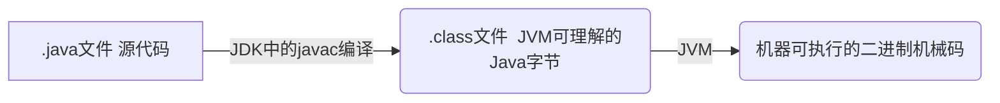

# 1 为什么Java中只有值传递

**按值调用**（call by value）表示方法接收的是调用者提供的值，而**按引用调用**（call by reference）表示方法接收的是调用者提供的变量地址。一个方法可以修改传递引用所对应的变量值，而不能修改传递值调用所对应的变量值。

**Java程序设计语言总是采用按值调用，实际上，对象引用是按值传递的。**也就是说，方法得到的是所有参数值的一个拷贝，也就是说，方法不能修改传递给它的任何参数变量的内容。

下面总结一下Java中方法参数的使用情况：

- 一个方法不能修改一个基本参数类型的参数（即数值型或布尔型）。
- 一个方法可以改变一个对象参数的状态。
- 一个方法不能让对象参数引用一个新的对象。

# 2 ==与equals

**==：**它的作用是判断两个对象的地址是不是相等。即判断两个对象是不是同一个对象。（基本数据类型 == ： 比较的是值，引用数据类型 ==： 比较的是内存地址）。

**equals()：**它的作用是判断连个对象是否相等。但它一般有两种使用情况：

- 情况1：类没有覆盖equals()方法。则通过equals()比较该类的两个对象时，等价于通过“==”比较这两个对象。
- 情况2：类覆盖了equals()方法。一般，我们都覆盖equals()方法来判断两个对象的内容是否相等；若它们的内容相等，则返回true（即认为这两个对象相等）。

# 3 hashCode()与equals()

## 3.1 hashCode()介绍

hashCode()的作用是获取哈希码，也成为散列码；它实际上返回一个int整数。这个哈希码的作用是确定该对象在哈希表中的索引位置。

hashCode()定义在JDK的Object类中，这意味着Java中的任何类都包含有hashCode()函数。另外需要注意的是：Object类中的hashCode()方法是本地方法，也就是用c或者c++实现的，该方法通常用来将对象的内存地址转换为整数之后返回。

## 3.2 为什么要有hashCode？

**我们以“HashSet如何检查重复”为例子来说明为什么要有hashCode:**

当把对象加入HashSet时，HashSet会先计算对象的hashCode值来判断对象加入的位置，同时也会与其它已经加入的对象的hashCode值比较，如果没有相符的hashCode，HashSet会假设对象没有重复出现。但是如果发现有相同的hashCode值得对象，这时会调用equals()方法来检测hashCode相等的对象是否真的相同。如果两者相同，HashSet就不会让其加入操作成功；如果不同的话，就会重新散列到其他位置。这样就大大减少了equals的次数，相应就大大提高了执行速度。

## 3.3 为什么重写equals时必须重写hashCode方法？

两个对象相等，对两个对象分别调用equals方法都返回true。如果两个对象相等，则hashCode一定也是相同的。但是，两个对象有相同的hashCode值，他们不一定是相等的（哈希冲突：不同的数据对应相同的哈希值）。因此，equals方法被覆盖过，则hashCode方法也必须被覆盖。

hashCode()的默认行为是对堆上的对象产生独特值。如果没有重写hashCode()，则该class的两个对象无论如何都不会相等（即使这两个对象有相等的数据）。

## 3.4 为什么两个对象有相同的hashCode值，但它们也不一定是相等的？

因为hashcode()所使用的杂凑算法也许刚好会让多个对象传回相同的杂凑值。越糟糕的杂凑算法越容易碰撞，但这也与数据值域分布的特点有关（所谓碰撞也就是指不同的对象得到相同的hashCode)。

我们刚刚也提到HashSet，如果HashSet在对比的时候，同样的hashCode有多个对象，它会使用equals()来判断是否真的相同。也就是说hashCode只是用来缩小查找成本。

# 4 String和StringBuffer、StringBuilder的区别是什么？String为什么是不可变得？

## 4.1 String和StringBuffer、StringBuilder的区别是什么？

**可变性：**

String类中使用final关键字修饰字符数组来保存字符串，`private final char value[]`，所以String对象是不可变的。而StringBuilder与StringBuffer都继承自AbstractStringBuilder类，在AbstractStringBuilder中也是使用字符数组保存字符串 `char[] value`，但是没有使用final关键字，所以这两种对象都是可变的。

**线程安全性：**

String中的对象是不可变的，也就可以理解为常量，线程安全。

StringBuffer对方法加了同步锁或者对调用的方法加同步锁，所以是线程安全的。

StringBuilder并没有对方法进行加同步锁，所以是非线程安全的。

**性能：**

每次对String类型进行改变时，都会生成一个新的String对象，然后将指针指向新的String对象。StringBuffer每次都会对StringBuffer对象本身进行操作，而不是生成新的对象并改变对象引用。相同情况下使用StringBuiler相比使用StringBuffer仅能获得10%~15%左右的性能提升，但却要冒多线程不安全的风险。

**对于三者使用的总结：**

1. 操作少量的数据：适用String
2. 单线程操作字符串缓冲区下大量数据：适用StringBuilder
3. 多线程操作字符串缓冲区下大量数据：适用StringBuffer

## 4.2 String为什么是不可变得？

- 简单来说就是String类利用了final修饰的char类型数组存储字符。

- String不可变但不代表引用不可以变。实际上，原来String的内容是不变的，只是str由原来指向"hello"的内存地址转为指向"hello world"的内存地址而已，也就是说多开辟了一块内存区域给"hello world"字符串。
- 通过反射是可以修改所谓的“不可变”对象的。用反射可以访问私有成员，然后反射出String对象中的value属性，进而通过获得的value引用改变数组结构。但是一般我们不会这么做，这里只是简单提一下这个东西。

# 5 什么是反射机制？反射机制的应用场景有哪些？

## 5.1 反射机制介绍

Java反射机制是在运行状态中，对于任意一个类，都能够知道这个类的所有属性和方法；对于任意一个对象，都能够调用它的任意一个方法和属性；这种动态获取信息以及动态调用对象的方法的功能称为Java语言的反射机制。

## 5.2 静态编译和动态编译

- **静态编译：**在编译时确定类型，绑定对象
- **动态编译：**运行时确定类型，绑定对象

## 5.3 反射机制优缺点

- **优点：**运行期类型的判断，动态加载类，提高代码灵活度。
- **缺点：**性能瓶颈。反射相当于一系列解释操作，通知JVM要做的事情，性能比直接的Java代码要慢得多。

## 5.4 反射的应用场景

**反射是框架设计的灵魂。**

模块化开发，通过反射去调用对应的字节码；动态代理设计模式也采用了反射机制；Spring / Hibernate等框架也大量使用到了反射机制。

# 6 什么是JDK？什么是JRE？什么是JVM？三者之间的联系与区别

## 6.1 JVM

Java虚拟机（JVM）是运行Java字节码的虚拟机。JVM有针对不同系统的特定实现（Windows、Linux、macOS），目的是使用相同的字节码，它们都会给出相同的结果。

**Java程序从源码到运行一般有下面3步：**

我们需要格外注意的是“.class -> 机械码” 这一步。在这一步JVM类加载器首先加载字节码文件，然后通过解释器逐行解释执行，这种方式的执行速度会相对比较慢。

## 6.2 JDK和JRE

JDK是 Java Development Kit，它是功能齐全的Java SDK。它拥有JRE所拥有的一切，还有编译器（javac）和工具（如javadoc和jdb）。它能够创建和编译程序。

JRE是Java运行时环境。它是运行已编译Java程序所需要的所有内容的集合，包括Java虚拟机（JVM），Java类库，Java命令和其它的一些基础构件。但是，它不能用于创建新程序。（使用JSP部署Web应用程序时，应用程序服务器会将JSP转换为Java servlet，并且需要使用JDK来编译servlet）

# 7 什么是字节码？采用字节码的最大好处是什么？

在Java中，JVM可以理解的代码就叫做字节码（即扩展名为 `.class`的文件），它不面向任何特定的处理器，只面向虚拟机。

Java语言通过字节码的方式，在一定程度上解决了传统解释型语言执行效率低的问题，同时又保留了解释型语言可移植的特点。所以Java程序运行时比较高效，而且，由于字节码并不针对一种特定的机器，因此，Java程序无需重新编译便可在多种不同操作系统的计算机上运行。

# 8 接口和抽象类的区别是什么？

1. 接口的方法默认是public，所有方法在接口中不能有实现（Java8后接口可以有默认实现（default））。
2. 接口中的实例变量默认是final类型，而抽象类中则不一定。
3. 一个类可以实现多个接口，但最多只能实现一个抽象类。
4. 一个类实现接口的话要实现接口的所有方法，而抽象类不一定。
5. 接口不能用new实例化，但可以声明，但是必须引用一个实现该接口的对象。从设计层面来说，抽象是对类的抽象，是一种模板设计，接口是行为抽象，是一种行为的规范。

# 9 重载和重写的区别

**重载：**发生在一个类中，方法名必须相同，参数类型不同、个数不同、顺序不同，方法返回值和访问修饰符可以不同。

要完整地描述一个方法，需要指出方法名以及参数类型。这叫做方法的签名。返回类型不是方法签名的一部分。也就是说，不能有两个名字相同、参数类型也想同却返回不同类型值的方法。

**重写：**是子类对父类允许访问的方法的实现过程进行重新编写，发生在子类中，方法名、参数列表必须相同，返回值范围小于等于父类，抛出的异常范围小于等于父类，访问修饰符范围大于等于父类。另外，如果父类方法访问修饰符为private，则子类就不能重写该方法。**也就是说方法提供的行为改变，而方法的外貌并没有改变。**

# 10 Java面向对象编程三大特性：封装、集成、多态

**封装：**把一个对象的属性私有化，同时提供一些可以被外界访问属性的方法，如果属性不想被外界访问，我们大可不必提供方法给外界访问。但是如果一个类没有提供给外界访问的方法，那么这类也就没有什么意义了。

**继承：**是使用已存在的类的定义作为基础建立新类的技术，新类的定义可以增加新的数据或新的功能，也可以用父类的功能，但不能选择性地继承父类。通过使用继承我们能够非常方便地复用以前的代码。

1. 子类拥有父类对象所有的属性和方法（包括私有属性和私有方法），但是父类中的私有属性和私有方法子类是无法访问的，只是拥有。
2. 子类可以拥有自己的属性和方法，即子类可以对父类进行扩展。
3. 子类可以用自己的方式实现父类的方法。

**多态：**是指程序中定义的引用变量所指向的具体类型和通过该引用变量发出的方法调用在编程时并不确定，而是在程序运行期间才确定，即一个引用变量到底会指向哪个类的实例对象，该引用变量发出的方法调用到底是哪个类中实现的方法，必须在由程序运行期间才能决定。

在Java中有两种形式可以实现多态：继承（多个子类对同一方法的重写）和接口（实现接口并覆盖接口中同一方法）。

# 11 什么是线程和进程？

**进程：**是程序的一次执行过程，是系统运行程序的基本单位，因此进程是动态的。系统运行一个程序即是一个进程从创建、运行到消亡的过程。

在Java中，当启动main函数时其实就是启动了一个JVM的进程，而main函数所在的线程就是这个进程中的一个线程，也称为主线程。

**线程：**线程与进程相似，但线程是一个比进程更小的执行单位。一个进程在执行的过程中可以产生多个线程。与进程不同的是同类的多个线程共享进程的堆和方法区资源，但每个线程有自己的**程序计数器、虚拟机栈和本地方法栈**，所以系统在产生一个线程或在各个线程之间切换工作时，负担要比进程小得多，因此线程也被称为轻量级进程。

# 12 请简要描述线程与进程的关系，区别及优缺点？

**从JVM角度说进程和线程之间的关系**

## 12.1 图解进程和线程的关系

下图是Java内存区域，通过下图我们从JVM的角度来说一下线程和进程之间的关系。

从上图可以看出：一个进程中可以有多个线程，多个线程共享进程的**堆和方法区**（**JDK1.8之后的元空间**）资源，但每个线程有自己的**程序计数器、虚拟机栈和本地方法栈。**

**总结：**线程是进程划分成的更小的运行单位。线程和进程最大的不同在于基本上各进程是独立的，而各线程则不一定，因为同一进程中的线程极有可能会相互影响。线程执行开销小，但不利于资源的管理和保护；而进程正相反。

## 12.2 程序计数器为什么是私有的？

程序计数器主要有下面两个作用：

1. 字节码解释器能通过改变程序计数器来依次读取指令，从而实现代码的流程控制，如：顺序执行、选择、循环、异常处理。
2. 在多线程的情况下，程序计数器用于记录当前线程执行的位置，从而当线程被切换回来的时候能够知道该线程上次运行到哪儿了。

需要注意的是，如果执行的是native方法，那么程序计数器记录的是undefined地址，只有执行的是Java代码时程序计数器记录的才是下一条指令的地址。

所以，程序计数器私有主要是为了线程切换后能恢复到正确的执行位置。

## 12.3 虚拟机栈和本地方法栈为什么是私有的？

- **虚拟机栈：**每个Java方法在执行的同时会创建一个栈帧用于存储局部变量表、操作数栈、常量池引用等信息。从方法调用直至执行完成的过程，就对应着一个栈帧在Java虚拟机栈中入栈和出栈的过程。
- **本地方法栈：**和虚拟机栈所发挥的作用非常相似，区别是：**虚拟机栈为虚拟机执行Java方法（也就是字节码）服务，而本地方法栈则是为虚拟机使用到的native方法服务。**在HotSpot虚拟机中，和Java虚拟机栈合二为一。

所以，**为了保证线程中的局部变量不被别的线程访问到**，虚拟机栈和本地方法栈是线程私有的。

## 一句话简单了解堆和方法区

堆和方法区是所有线程共享的资源，其中堆是进程中最大的一块内存，主要用于存放新创建的对象（所有对象都在这里分配内存），方法区主要用于存放已被加载的类信息、常量、静态变量、即时编译器编译后的代码等数据。

# 13 说说并发与并行的区别？

- **并发：**同一时间段，多个任务都在执行（单位时间内不一定同时执行）。
- **并行：**单位时间内，多个任务同时执行。

# 14 什么是上下文切换？

多线程编程中一般线程的个数大于CPU核心的个数，而一个CPU核心在任意时刻只能被一个线程使用，为了让这些线程都能得到有效执行，CPU采取的策略是为每个线程分配时间片并轮转的形式。当一个线程的时间片用完的时候就会重新处于就绪状态，把CPU让给其它线程使用，这个过程就属于一次上下文切换。

概括来说就是：当前任务在执行完CPU时间片，切换到另一个任务之前，会先保存自己的状态，以便下次再切换回这个任务时，可以再加载这个任务的状态。**任务从保存到再次加载的过程就是一次上下文切换。**

上下文切换通常是计算密集型的。也就是说，它需要相当可观的处理器时间，在每秒几十上百次的切换中，每次切换都需要纳秒量级的时间，事实上，可能是操作系统中时间消耗最大的操作。

Linux相比于其它操作系统（包括其它类Unix系统）有很多的优点，其中有一项就是，其上下文切换和模式切换的时间消耗非常少。

# 15 什么是线程死锁？如何避免死锁？

## 15.1 认识线程死锁

多个线程同时被阻塞，它们中的一个或者全部都在等待某个资源被释放。由于线程被无限期地阻塞，因此程序不可能正常终止。

产生死锁必须具备以下四个条件：

1. **互斥条件**：该资源任意一个时刻只由一个线程占用。
2. **请求与保持条件**：一个进程因请求资源而阻塞时，对已获得的资源保持不放。
3. **不剥夺条件**：线程已获得的资源在未使用完之前不能被其它线程强行剥夺，只有自己使用完毕后才能释放资源。
4. **循环等待条件**：若干进程之间形成一种头尾相接的循环等待资源关系。

## 如何避免线程死锁？

我们只要破坏产生死锁的四个条件中的其中一个就可以了。

**破坏互斥条件：**这个条件我们没有办法破坏，因为我们使用锁本来就是想让它们互斥的（临界资源需要互斥访问）。

**破坏请求与保持条件：**一次性申请所有的资源。

**破坏不剥夺条件：**占用部分资源的线程进一步申请其它资源时，如果申请不到，可以主动释放它占有的资源。

**破坏循环等待条件：**靠按序申请资源来预防。按某一顺序申请资源，释放资源则反序释放。

# 16 说说sleep()方法和wait()方法区别和共同点？

- 两者最主要的区别在于：**sleep()方法没有释放锁，而wait()方法释放了锁。**
- 两者都可以暂停线程的执行。
- wait()方法通常被用于线程间交互/通信，sleep()方法通常被用于暂停执行。
- wait()方法被调用后，线程不会自动苏醒，需要别的线程调用同一个对象上的notify()或者notifyAll()方法。sleep()方法执行完成后，线程会自动苏醒。或者可以使用wait(long timeout)超时后线程会自动苏醒。

# 17 为什么调用start()方法时会执行run()方法，为什么我们不能直接调用run()方法？

new一个Thread，线程进入了新建状态；调用start()方法，会启动一个线程并使线程进入了就绪状态，当分配到时间片后就可以开始运行了。statr()方法会执行线程的相关准备工作，然后自动执行run()方法的内容，这是真正的多线程工作。

而直接执行run()方法，会把run方法当成一个main线程下的普通方法去执行，并不会在某个线程中执行它，所以这并不是多线程工作。

**总结：调用start方法方可启动线程并使线程进入就绪状态，而run方法只是thread的一个普通方法调用，还是在主线程里执行。**

