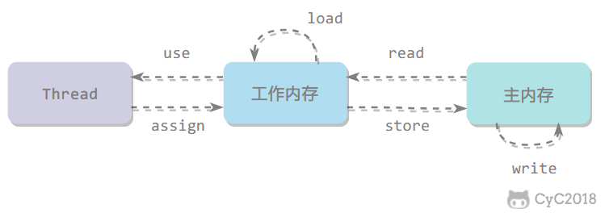
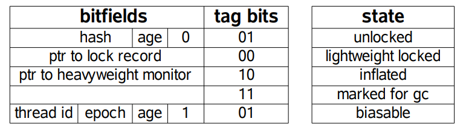

# 1 使用线程

有三种实现线程的方法：

- 实现Runnable接口；
- 实现Callable接口；
- 继承Thread类；


## 1.1 实现Runnable接口

需要实现接口中的run()方法。

使用Runnable接口实例再创建一个Thread实例，然后调用Thread实例的start()方法来启动线程 。


## 1.2 实现Callable接口

与Runnable相比，Callable可以有返回值，返回值通过FutureTask进行封装。


## 1.3 继承Thread类

同样也是需要实现run()方法，因为Thread类也实现了Runnable接口。

当调用start()方法启动一个线程时，虚拟机会将线程放入就绪队列中等待被调用，当一个线程被调度时会执行该线程的run()方法。


## 1.4 实现接口 VS 继承Thread

实现接口会更好一些，因为：

- Java不支持多重继承，因此继承了Thread类就无法继承其它类，但是可以实现多个接口；
- 类可能只要求可执行就行，继承整个Thread类开销过大。


# 2 基础线程机制

## 2.1 Daemon

守护线程是程序运行时在后台提供服务的线程，不属于程序中不可或缺的部分。当所有非守护线程结束时，程序也就终止，同时会杀死所有守护线程。

main()属于非守护线程。

在线程启动之前使用setDaemon()方法可以将一个线程设置为守护线程。


## 2.2 yield()

对静态方法Thread.yield()的调用声明了当前线程已经完成了生命周期中最重要的部分，可以切换给其它线程来执行。该方法只是对线程调度器的一个建议，而且也只是建议具有相同优先级的其它线程可以运行。


# 3 中断

一个线程执行完毕之后会自动结束，如果在运行过程中发生异常也会提前结束。

## 3.1 InterruptedException

通过调用一个线程的interrupt()来中断该线程，如果该线程处于阻塞、限期等待或者无限期等待状态，那么就会抛出InterruptedException,从而提前结束该线程。但是不能中断I/O阻塞和synchronized锁阻塞。


## 3.2 interrupted()

如果一个线程的run()方法执行一个无限循环，并且没有执行sleep()等会抛出InterruptedException的操作，那么调用线程的interrupt()方法就无法使线程提前结束。

但是调用interrupt()方法会设置线程的中断标记，此时调用interrupted()方法会返回true。因此可以在循环体中使用interrupt()方法来判断线程是否处于中断状态，从而提前结束线程。


## 3.3 Executor的中断操作

调用Executor的shutdown()方法会等待线程都执行完毕之后再关闭，但是如果调用的是shutdownNow()方法，则相当于调用每个线程的interrupt()方法。

如果只想中断Executor中的一个线程，可以通过使用submit()方法提交一个线程，它会返回一个Future<?>对象，通过调用该对象的cancel(true)方法就可以中断线程。


# 4 互斥同步

Java提供了两种锁机制来控制多个线程对共享资源的互斥访问，第一个是JVM实现的synchronized，而另一个是JDK实现的ReentrantLock。


## 4.1 synchronized

**1.同步一个代码块**

​	它只作用于同一个对象，如果调用两个对象上的同步代码块，就不会进行同步。

**2.同步一个方法**

**3.同步一个类**

​	作用于整个类，也就是说两个线程调用同一个类的不同对象上的这种同步语句，也会进行同步。

**4.同步一个静态方法**

​	作用于整个类。


## 4.2 ReentrantLock

是java.util.concurrent (J.U.C)包中的锁。


## 4.3 比较

1. **锁的实现**

   synchronized是JVM实现的，而ReentrantLock是JDK实现的。

2. **性能**

   现版本Java对 synchronized进行了很多优化，例如自旋锁等，synchronized与ReentrantLock大致相同。

3. **等待可中断**

   当持有锁的线程长期不释放锁的时候，正在等待的线程可以选择放弃等待，改为处理其它事情。

   ReentrantLock可中断，而synchronized不行。

4. **公平锁**

   公平锁是指多个线程在等待同一个锁时，必须按照申请锁的时间顺序来依次获得锁。

   synchronized中的锁是非公平的，ReentrantLock默认情况下也是非公平的，但是也可以是公平的。

5. **锁绑定多个条件**

   一个ReentrantLock可以同时绑定多个Condition对象。


## 4.4 使用选择

除非需要使用ReentrantLock的高级功能，否则优先使用synchronized。这是因为synchronized是JVM实现的一种锁机制，JVM原生地支持它，而ReentrantLock不是所有的JDK版本都支持。并且使用synchronized不用担心没有释放锁而导致死锁问题，因为JVM会确保锁的释放。


# 5 线程之间合作

## 5.1 join()

在线程中调用另一个线程的join()方法，会将当前线程挂起，而不是忙等待，直到目标线程结束。


## 5.2 wait()	notify()	notifyAll()

调用wait()使得线程等待某个条件满足，线程在等时会被挂起，当其它线程的运行使得这个条件满足时，其它线程会调用notify()或者notifyAll()来唤醒挂起的线程。

它们都属于Object的一部分，而不属于Thread。

只能在同步方法或者同步控制块中使用，否则会在运行时抛出异常。

使用wait()挂起期间，线程会释放锁。这是因为，如果没有释放锁，那么其它线程就无法进入对象的同步方法或者同步控制块中，那么久无法执行notify()或者notifyAll()来唤醒挂起的线程，造成死锁。


**wait()和sleep()的区别：**

- wait()是Object的方法，而sleep()是Thread的静态方法；
- wait()会释放锁，sleep()不会。


## 5.3 await()	signal()	signalAll()

java.util.concurrent类库中提供了Condition类来实现线程之间的协调，可以Condition上调用await()方法使线程等待，其它线程调用signal()或signalAll()方法唤醒等待的线程。

相比于wait()这种等待方式，await()可以指定等待的条件，因此更加灵活。


# 6 线程状态

一个线程只能处于一种状态，并且这里的线程状态特指Java虚拟机的线程状态，不能反映线程在特定操作系统下的状态。

1. **新建(NEW)**

   创建后尚未启动。

2. **可运行(RUNABLE)**

   正在Java虚拟机中运行。但是在操作系统层面，它可能正处于运行状态，也可能等待资源调度（例如处理器资源），资源调度完成就进入运行状态。所以该状态的可运行是指可以别运行，具体有没有运行要看地城操作系统的资源调度。

3. **阻塞(BLOCKED)**

   请求获取monitor lock从而进入sunchronized函数或者代码块，但是其它线程已经占用了该monitor lock，所以处于阻塞状态。要结束该状态从而进入RUNABLE需要其它线程释放monitor lock。

4. **无限期等待（WAITING)**

   等待其它线程显式地唤醒。

   阻塞和等待的区别在于，阻塞是被动的，它是在等待获取monitor lock。而等待是主动的，通过调用Object.wait()等方法进入。

5. **限期等待（TIMED_WAITING)**

   无需等待其它线程显式地唤醒，在一定时间之后会被系统自动唤醒。

6. **死亡（TERMINATED)**

   可以是线程结束任务之后自己结束，或者产生了异常而结束。

   

# 7 J.U.C - AQS

AQS是AbstractQuenedSynchronizer 抽象的队列式同步器。是除了Java自带的synchronized关键字之外的锁机制。

AQS的核心思想是，如果被请求的共享资源空闲，则将当前请求资源的线程设置为有效的工作线程，并将共享资源设置为锁定状态，如果被请求的共享资源被占用，那么久需要一套线程阻塞等待以及被唤醒时锁分配的机制，这个机制AQS是用CLH（CLH队列是FIFO的双端双向队列，实现公平锁）队列锁实现的，即将暂时获取不到锁的线程加入到队列中。


## 7.1 CountDownLatch

用来控制一个或者多个线程等待多个线程。

维护了一个计数器cnt，每次调用countDown()方法会让计数器的值减1，减到0的时候，那些因为调用await()方法而在等待的线程就会被唤醒。


## 7.2 CyclicBarrier

用来控制多个线程相互等待，只有当多个线程都到达时，这些线程才会继续执行。

和CountdownLatch相似，都是通过维护计数器来实现的。线程执行await()方法之后计数器会减1，并进行等待，直到计数器为0，所有调用await()方法而在等待的线程太能继续执行。

CyclicBarrier和CountdownLatch的一个区别是，CyclicBarrier的计数器通过调用reset()方法可以循环使用，所以它才叫作循环屏障。

CyclicBarrier有两个构造函数，其中parties指示计数器的初始值，barrierAction在所有线程都到达屏障的时候会执行一次。

```java
public CyclicBarrier(int parties, Runnable barrierAction);
public CyckicBarrier(int parties);
```


## 7.3 Semaphore

Semaphore类类似于操作系统中的信号量，可以控制对互斥资源的访问线程数。


# 8 J.U.C - 其它组件

## 8.1 FutureTask

在介绍Callable时我们知道它可以有返回值，返回值通过Future进行封装。FutureTask实现了RunnableFuture接口，该接口继承自Runnable和Future接口，这使得FutureTask既可以当做一个任务执行，也可以有返回值。

FutureTask可用于异步获取执行结果或取消执行任务的场景。当一个计算任务需要执行很长时间，那么就可以用FutureTask来封装这个任务，主线程在完成自己的任务之后再去获取结果。


## 8.2 BlockingQueue

`java.util.concurrent.BlockingQueue`接口有以下阻塞队列的实现：

- **FIFO队列：**LinkedBlockingQueue、ArrayBlockingQueue（固定长度）
- **优先级队列：**PriorityBlockingQueue

提供了阻塞的task()和put()方法：如果队列为空，task()将阻塞，直到队列中有内容；如果队列为满，put()将阻塞，直到队列有空闲位置。


## 8.3 ForkJoin

主要用于并行计算中，和MapReduce原理类似，都是把大的计算任务拆分成多个小任务并行计算。

ForkJoin使用ForkJoinPool来启动，它是一个特殊的线程池，线程数量取决于CPU的核数。

ForkJoinPool实现了工作窃取算法来提高CPU的利用率。每个线程都维护了一个双端队列，用来存储需要执行的任务。工作窃取算法允许空闲的线程从其它线程的双端队列中窃取一个任务来执行。窃取的任务必须是最晚的任务，避免和队列所属线程发生竞争。如果队列中只有一个任务时还是会发生竞争。


#  9 线程不安全示例

如果多个线程对同一个共享数据进行访问而不采取同步操作的话，那么操作的结果是不一致的。


# 10 Java内存模型

Java内存模型试图屏蔽各种硬件和操作系统的内存访问差异，以实现让Java程序在各种平台下都能达到一致的内存访问效果。

## 10.1 主内存与工作内存

处理器上的寄存器的读写速度比内存快几个数量级，为了解决这种速度矛盾，在它们之间加入了高速缓存。

加入高速缓存带来了一个新的问题：缓存一致性。如果多个缓存共享一块主内存区域，那么多个缓存的数据可能会不一致，需要一些协议来解决这个问题。


所有的变量都存储在主内存中，每个线程还有自己的工作内存，工作内存存储在高速缓存或者寄存器中，保存了该线程使用的变量的主内存副本拷贝。

线程只能直接操作工作内存中的变量，不同线程之间的变量值传递需要通过主内存来完成。


## 10.2 内存间交互操作

Java内存模型定义了8个操作来完成主内存和工作内存的交互操作。



- **read：**把一个变量的值从主内存传输到工作内存中；
- **load：**在read之后执行，把read得到的值放入工作内存的变量副本中；
- **use：**把工作内存中的一个变量的值传递给执行引擎；
- **assign：**把一个从执行引擎收到的值赋给工作内存的变量；
- **store：**把工作内存的一个变量的值传送到主内存中；
- **write：**在store之后执行，把store得到的值放入主内存的变量中；
- **lock：**作用于主内存的变量，它把一个变量标识为一条线程独占的状态；
- **unlock：**作用于主内存的变量，它把一个处于锁定状态的变量释放出来，释放后的变量才可以被其它线程锁定。


## 10.3 内存模型三大特性

1. ### **原子性**

   Java内存模型保证了read、load、use、assign、store、write、lock和unlock操作具有原子性。但是Java内存模型允许虚拟机将没有被volatile修饰的64位数据（long、double）的读写操作划分为两次32位的操作来进行，即load、store、read和write操作可以不具备原子性。

   有一个错误的认识就是，int等原子性的类型在多线程环境中不会出现线程安全问题。

   AtomicInteger能保证多个线程修改的原子性。

   除了使用原子类之外，也可以使用synchronized互斥锁来保证操作的原子性。

   

2. **可见性**

   可见性指当一个线程修改了共享变量的值，其它线程能够立即得知这个修改。Java内存模型是通过在变量修改后将新值同步回主内存，在变量读取前从主内存刷新变量值来实现可见性的。

   主要有三种实现可见性的方式：

   - volatile，是一种稍弱的同步机制，在访问volatile变量时不会执行加锁操作，因此也就不会使执行线程阻塞，因此volatile变量是一种比synchronized关键字更轻量级的同步机制
   - synchronized，对一个变量执行unlock操作之前，必须把变量值同步回主内存。
   - final，被final关键字修饰的字段在构造器中一旦初始化完成，并且没有发生this逃逸（其它线程通过this引用访问初始化了一半的对象），那么其它线程就能看见final字段的值。


3. 有序性

   有序性是指：在本线程内观察，所有操作都是有序的。在一个线程观察另一个线程，所有操作都是无序的，无序是因为发生了指令重排。在Java内存模型中，允许编译器和处理器对指令进行重排序，重排序过程不会影响到单线程程序的执行，确会影响到多线程并发执行的正确性。

   volatile关键字通过添加内存屏障的方式来禁止指令重排，即重排序时不能把后面的指令放到内存屏障之前。

   也可以通过synchronized来保证有序性，它保证每个时刻只有一个线程执行同步代码，相当于是让线程顺序执行同步代码。


## 10.4 先行发生原则

1. **单一线程原则：**在一个线程内，在程序前面的操作先行发生于后面的操作。
2. **管程锁定规则：**一个unlock操作先行发生于后面对同一个锁的lock操作。
3. **volatile变量规则：**对一个volatile变量的写操作先行发生于后面对这个变量的读操作。
4. **线程启动规则：**Thread对象的statr()方法调用先行发生于此线程的每个动作。
5. **线程加入规则：**Thread对象的结束先行发生于join()方法返回。
6. **线程中断规则：**对线程interrupt()方法的调用先行发生于被中断线程的代码检测到中断事件的发生，可以通过interrupted()方法检测到是否有中断发生。
7. **对象终结规则：**一个对象的初始化完成（构造函数执行结束）先行发生于它的finalized()方法的开始。
8. **传递性：**如果操作A先行发生于操作B，操作B先行发生于操作C，那么操作A先行发生于操作C。


# 11 线程安全

多个线程不管以何种方式访问某个类，并且在主调代码中不需要进行同步，都能表现正确的行为。


线程安全有一下几种实现方式：


## 11.1 不可变

不可变对象一定是线程安全的，不需要再采取任何的线程安全保障措施。只要一个不可变对象被正确地构建出来，永远也不会看到它在多个线程之中处于不一致的状态。多线程环境下，应尽量使对象成为不可变，来满足线程安全。


## 11.2 互斥同步

synchronized和ReentrantLock。


## 11.3 阻塞同步

互斥同步最主要的问题就是线程阻塞和唤醒所带来的性能问题，因此这种同步也称为阻塞同步。

互斥同步属于一种悲观的并发策略，总是认为只要不去做就正确的同步措施，那就肯定会出现问题。无论共享数据是否真的会出现竞争，它都要进行加锁、用户态和心态转换、维护锁计数器和检查是否有被阻塞的线程需要唤醒等操作。

随着硬件指令集的发展我们可以使用基于冲突检测的乐观并发策略：先进行操作，如果没有其它线程争用共享数据，那操作就成功了，否则采取补偿措施。这种乐观的并发策略的许多实现都不需要将线程阻塞，因此这种同步操作称为非阻塞同步。

1. **CAS**

   乐观锁需要操作和冲突检测这两个步骤具备原子性，这里就不能再使用互斥同步来保证了，只能靠硬件来完成。硬件支持的原子性操作最经典的是：比较并交换（Compare-and-Swap，CAS）。CAS指令需要有3个操作数，分别是内存地址V、旧的预期值A和新值B。当执行操作时，只有当V的值等于A，才将V的值更新为B。

2. **AtomicInteger**

   J.U.C包里面的整数原子类AtomicInteger的方法调用了Unsafe类的CAS操作。

3. **ABA**

   如果一个变量初次读取的时候是A值，它的值被改成了B，后来又被改回A，那CAS操作就会误认为它从来没有改变过。

   J.U.C包提供了一个带有标记的原子引用类AtomicStampedReference来解决这个问题，它可以通过控制变量值得版本来保证CAS的正确性。大部分情况下ABA问题不会影响程序并发的正确性，如果需要解决ABA问题，改用传统的互斥同步可能会比原子类更高效。


## 11.4 无同步方案

要保证线程安全，并不是一定就要进行同步。如果一个方法本来就不涉及共享数据，那它自然就无需任何同步措施去保证正确性。

1. **栈封闭**

   多个线程访问同一个方法的局部变量时，不会出现线程安全问题，因为局部变量存储在虚拟机栈中，属于线程私有的。

2. **线程本地存储**

   如果一段代码中所需要的的数据必须与其它代码共享，那就看看这些共享数据的代码是否能保证在同一个线程中执行。如果能保证，我们就可以把共享数据的可见范围限制在一个线程之内，这样，无须同步也能保证线程之间不会出现数据竞争的问题。

   符合这个特点的应用并不少见，大部分使用消费队列的框架模型都会将产品的消费过程尽量在一个线程中消费完。其中最重要的一个应用实例就是经典web交互模型中的“一个请求对应一个服务器线程”的处理方式，这种处理方式的广泛应用使得很多web服务端应用都可以使用线程本地存储来解决线程安全问题。

   **可以使用java.lang.TheadLocal类来实现线程本地存储功能**

   在一些场景（尤其是使用线程池）下，由于ThreadLocal.ThreadLocalMap的底层数据结构导致ThreadLocal有内存泄漏的情况，应该尽可能在每次使用ThreadLocal后手动调用remove()，以避免出现ThreadLocal经典的内存泄漏甚至是造成自身业务混乱的风险。

3. **可重入代码（Reentrant Code）**

   这种代码也叫作纯代码（Pure Code），可以在代码执行的任何时刻中断它，转而去执行另一段代码（包括地柜调用它本身），而在控制权返回后，原来的程序不会出现任何错误。

   可重入代码有一些共同的特征，例如不依赖存储在堆上的数据和公用的系统资源、用到的状态量都由参数传入、不调用非可重入的方法等。


# 12 锁优化

这里的锁优化主要是指JVM对synchronized的优化。


## 12.1 自旋锁

互斥同步进入阻塞状态的开销都很大，应该尽量避免。在许多应用中，共享数据的锁定状态只会持续很短的一段时间。自旋锁的思想是让一个线程在请求一个共享数据的锁时执行忙循环（自旋）一段时间，如果在这段时间内能获得锁，就可以避免进入阻塞状态。

自旋锁虽然能避免进入阻塞状态从而减少开销，但是它需要进行忙循环操作占用CPU时间，它只适用于共享数据的锁定状态很短的场景。

在JDK1.6中引入了自适应的自旋锁。自适应意味着自旋的次数不再固定了，而是由前一次在同一个锁上的自旋次数及锁的拥有者的状态来决定。


## 12.2 锁消除

锁消除是指对于被检测出不可能存在竞争的共享数据的锁进行消除。

锁消除主要是通过逃逸分析来支持，如果堆上的共享数据不可能逃逸出去呗其它线程访问到，那么就可以把它们当成私有数据对待，也就可以将他们的锁进行消除。


## 12.3 锁粗化

如果一系列的连续操作都对同一个对象反复加锁和解锁，频繁的加锁操作就会导致性能损耗。

如果虚拟机探测到由这样的一串零碎的操作都对同一个对象加锁，将会把锁的范围扩展（粗化）到整个操作序列的外部。这样只需要加锁一次就可以了。


## 12.4 轻量级锁

JDK1.6引入了偏向锁和轻量级锁，从而让锁拥有了四个状态：无锁状态（unlocked）、偏向锁状态（biasble）、轻量级锁状态（lightweight locked）和重量级锁状态（inflated）。

以下是HotSpot虚拟机对象头的内存布局，这些数据被称为Mark Word。其中tag bits对应了五个状态，这些状态在右侧的state表格中给出。



轻量级锁是相对于传统的重量级锁而言，它是用CAS操作来避免重量级锁使用互斥量的开销。对于绝大部分的锁，在整个同步周期内都是不存在竞争的，因此也就不需要都是用互斥量进行同步，可以先采用CAS操作进行同步，如果CAS失败了在改用互斥量进行同步。


## 12.5 偏向锁

偏向锁的思想是偏向于让第一个获取锁对象的线程，这个线程在之后获取该锁就不再需要进行同步操作，甚至连CAS操作也不再需要。

当锁对象第一次被线程获得的时候，进入偏向状态，标记为1 01。同时使用CAS操作将线程ID记录到Mark Word中，如果CAS操作成功，这个线程以后每次进入这个锁相关的同步块就不需要再进行任何同步操作。

当有另一个线程去尝试获取这个锁对象时，偏向状态就宣告结束，此时撤销偏向（Revoke Bias）后恢复到未锁定状态或轻量级锁状态。


